# Customer Churn Prediction and Retention Strategy Analysis

## Overview

This is an applied data analytics portfolio project using the public Telco Customer Churn dataset. The project predicts customer churn, explains churn-related factors, and turns model outputs into practical retention ideas.

I built this project to practise a realistic data workflow: data cleaning, exploratory analysis, machine learning model comparison, feature interpretation, customer risk segmentation, threshold analysis, and business recommendations.

This is not original research and it is not a production churn system. It is a graduate application portfolio project that shows how I approach a business analytics problem with Python.

## Why This Project

Customer churn is a common problem for subscription-based businesses. When customers leave, the company loses future revenue and may need to spend more money to acquire new customers.

The main question is:

> Which customers are more likely to churn, and how can the company use this information to plan retention actions?

I chose this topic because it connects data science with business decision-making. It also fits my interest in data analysis, business analytics, information systems, and technology management.

## Dataset

The project uses the public Telco Customer Churn dataset. Each row represents one customer.

Important variables include:

| Column | Meaning |
|---|---|
| `customerID` | Customer identifier |
| `tenure` | Number of months the customer has stayed |
| `Contract` | Contract type |
| `PaymentMethod` | Customer payment method |
| `MonthlyCharges` | Monthly bill amount |
| `TotalCharges` | Total amount charged |
| `InternetService` | Internet service type |
| `Churn` | Whether the customer left |

The target variable is `Churn`.

## Workflow

The project is organized into six scripts:

1. `01_data_cleaning.py`: load raw data, check data quality, clean `TotalCharges`
2. `02_exploratory_analysis.py`: explore churn patterns and generate EDA figures
3. `03_modeling.py`: train and compare four classification models
4. `04_business_insights.py`: extract feature importance and write business notes
5. `05_customer_risk_segmentation.py`: convert churn probabilities into risk groups
6. `06_threshold_recall_analysis.py`: compare different probability thresholds

## Key Results

The EDA results show that churn is not evenly distributed across customer groups.

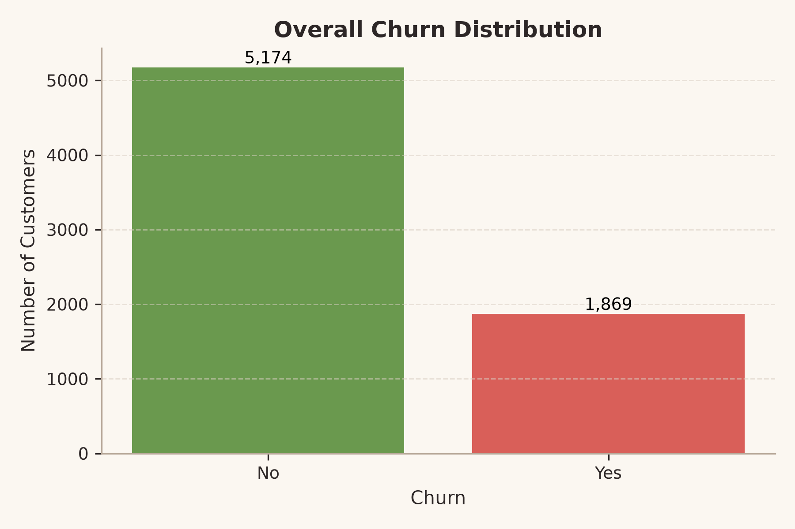

Customers with month-to-month contracts have a much higher churn rate than customers with one-year or two-year contracts.

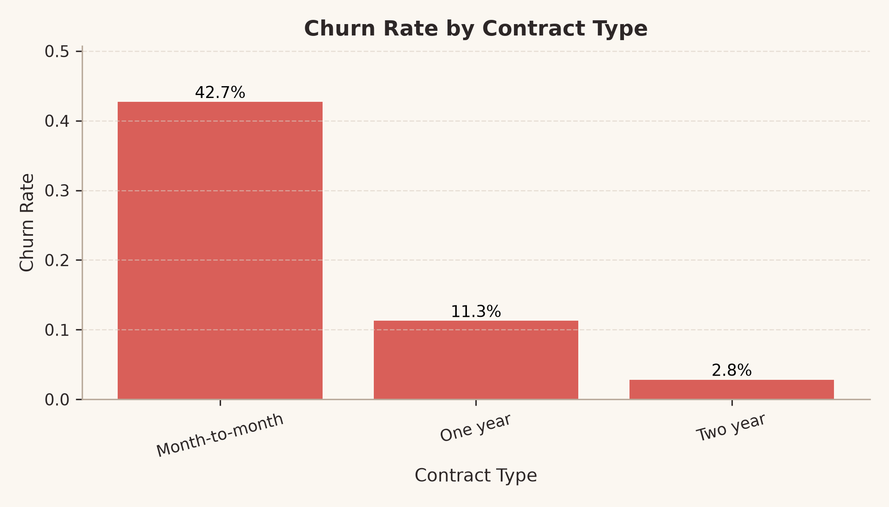

Payment method and internet service type are also related to churn. Electronic check users and fiber optic users show higher churn rates in this dataset.

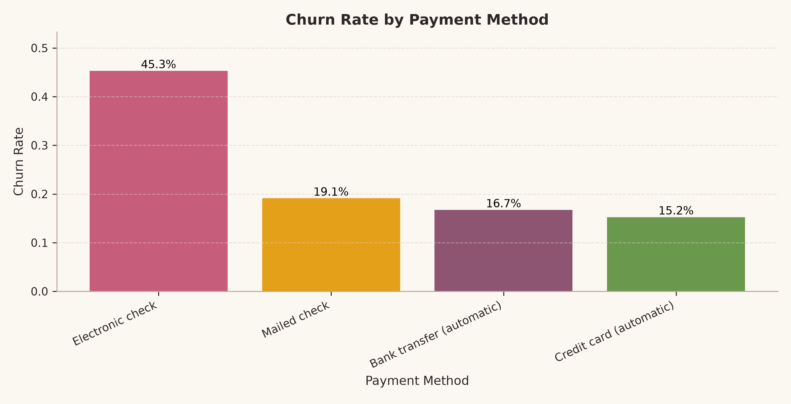

Customers who churn also tend to have shorter tenure and higher monthly charges.

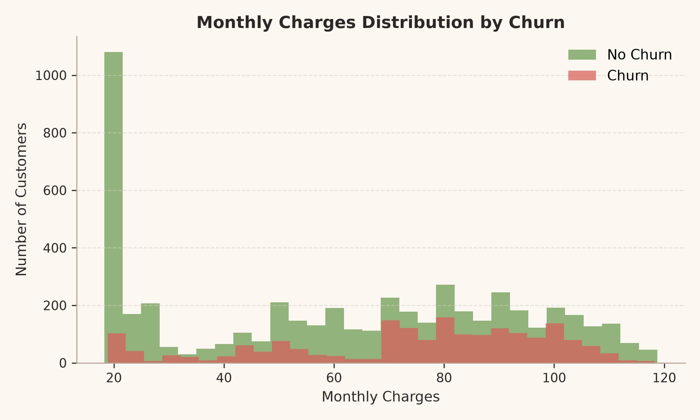

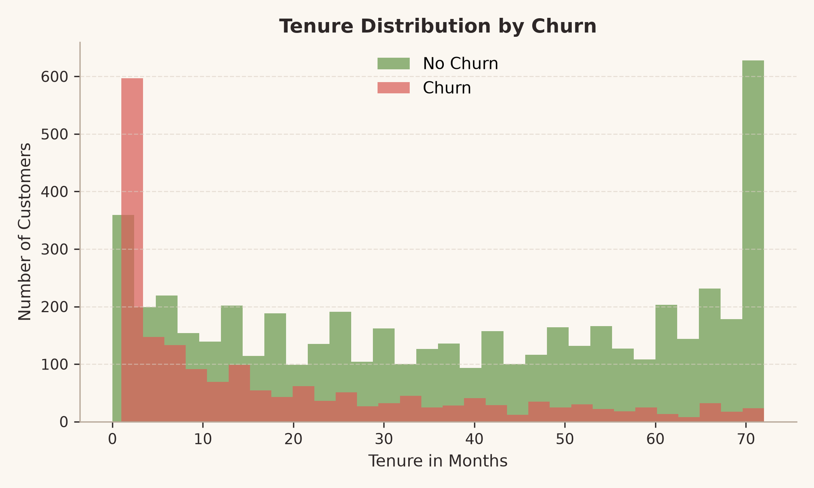

## Model Comparison

I compared four common classification models:

- Logistic Regression
- Decision Tree
- Random Forest
- Gradient Boosting

The model comparison results are saved in `reports/model_comparison.csv`.

| Model | Accuracy | Precision | Recall | F1-score | ROC-AUC |
|---|---:|---:|---:|---:|---:|
| Gradient Boosting | 0.806 | 0.674 | 0.524 | 0.589 | 0.843 |
| Logistic Regression | 0.806 | 0.657 | 0.559 | 0.604 | 0.842 |
| Random Forest | 0.775 | 0.598 | 0.465 | 0.523 | 0.819 |
| Decision Tree | 0.729 | 0.490 | 0.505 | 0.497 | 0.657 |

Gradient Boosting had the highest ROC-AUC in this result. Logistic Regression had slightly higher recall and F1-score, which is useful in a churn context because missing likely churn customers may mean missing retention opportunities.

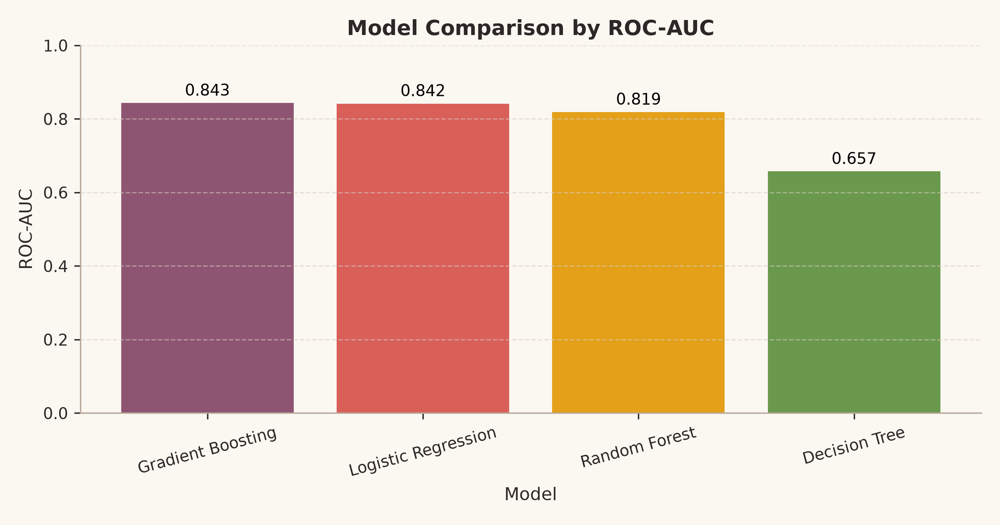

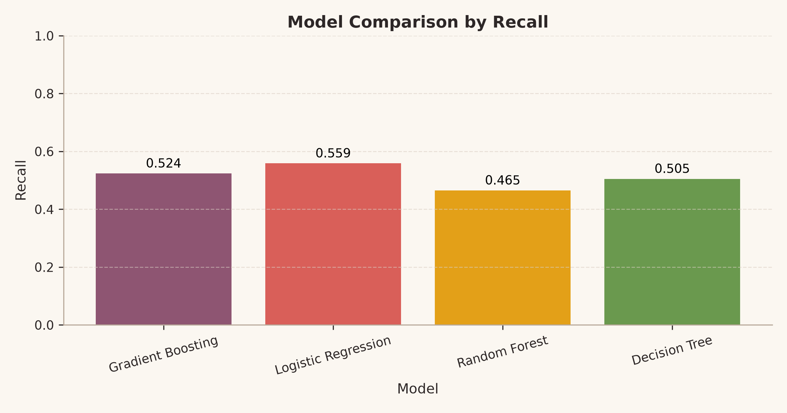

## Feature Importance

The feature importance analysis suggests that the following factors are strongly related to churn:

- Month-to-month contract
- Tenure
- Fiber optic internet service
- Total charges
- Monthly charges
- No online security
- Electronic check payment
- No tech support

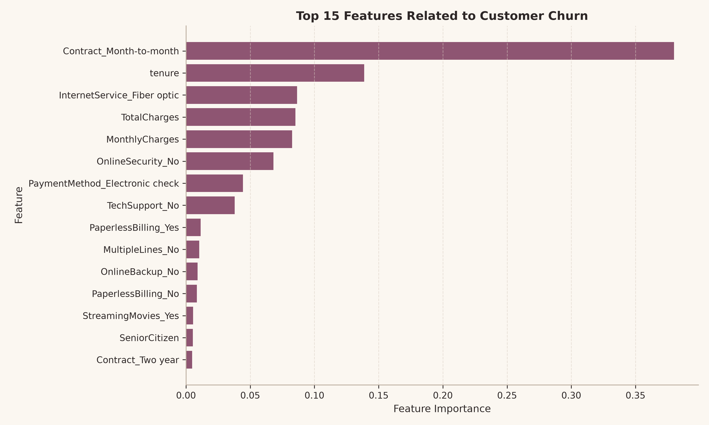

These results make business sense. Customers with flexible contracts, short tenure, high monthly charges, and fewer support services may have fewer reasons to stay.

## Customer Risk Segmentation

To make the model output easier to use, I converted predicted churn probability into three risk groups:

| Risk Segment | Rule |
|---|---|
| Low Risk | Predicted churn probability below 0.30 |
| Medium Risk | Predicted churn probability from 0.30 to 0.60 |
| High Risk | Predicted churn probability above 0.60 |

The high-risk group has a much higher actual churn rate and shorter average tenure.

| Risk Segment | Customer Count | Actual Churn Rate | Average Tenure | Average Monthly Charges |
|---|---:|---:|---:|---:|
| Low Risk | 4,374 | 9.8% | 42.4 | 57.3 |
| Medium Risk | 1,630 | 42.3% | 20.4 | 73.5 |
| High Risk | 1,039 | 72.1% | 8.9 | 82.4 |

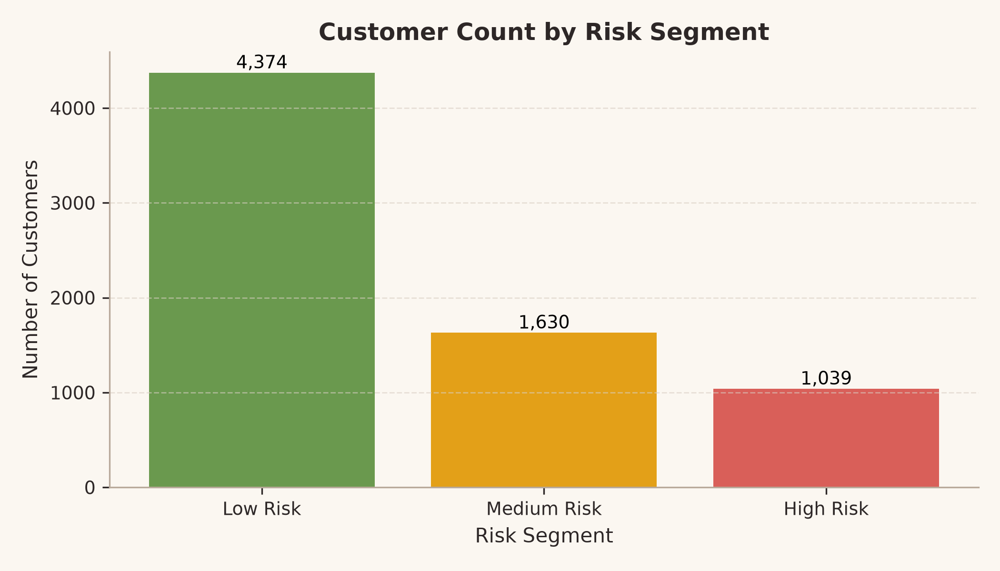

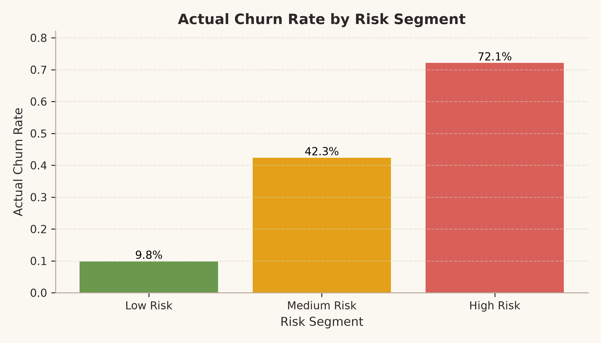

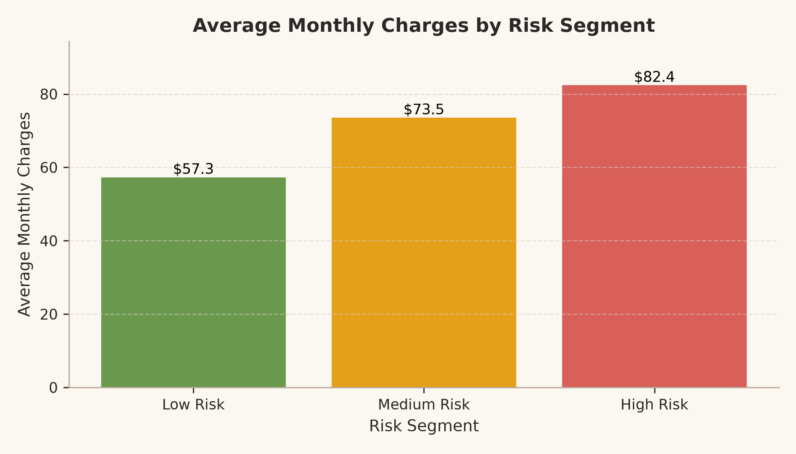

## Threshold and Recall Analysis

The default probability threshold of 0.50 is not always the best choice for churn prediction. A lower threshold catches more possible churn customers, but it also creates more false positives.

The threshold comparison is saved in `reports/threshold_comparison.csv`.

| Threshold | Precision | Recall | F1-score | Accuracy | Predicted Churn Customers |
|---:|---:|---:|---:|---:|---:|
| 0.30 | 0.519 | 0.754 | 0.615 | 0.749 | 543 |
| 0.40 | 0.569 | 0.668 | 0.615 | 0.778 | 439 |
| 0.50 | 0.657 | 0.559 | 0.604 | 0.806 | 318 |
| 0.60 | 0.718 | 0.401 | 0.515 | 0.799 | 209 |
| 0.70 | 0.739 | 0.182 | 0.292 | 0.766 | 92 |

At threshold 0.30, recall increases to 0.754, but precision drops to 0.519. At threshold 0.70, precision increases to 0.739, but recall drops to 0.182. This shows why the final threshold should depend on retention cost, customer value, and campaign budget.

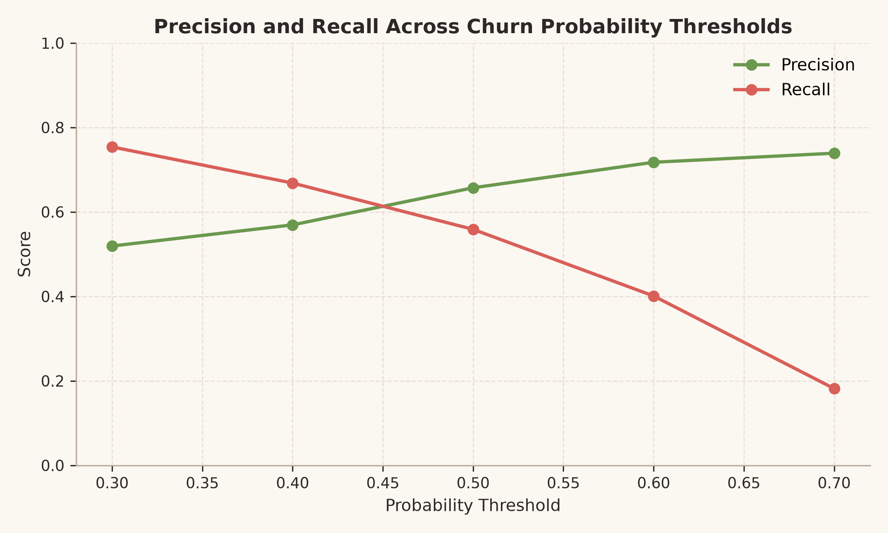

## Business Recommendations

Based on the analysis, I would suggest:

1. Give renewal incentives to high-risk month-to-month customers.
2. Improve onboarding support for new customers in their first few months.
3. Review high monthly charge customers and offer better bundles where possible.
4. Encourage more stable payment methods by making them convenient.
5. Provide targeted technical support to customers without support services.
6. Use churn probability scores to prioritize retention campaigns instead of contacting all customers in the same way.

## Limitations

This project has several limitations:

- The dataset is public and does not include live company data.
- The models are basic and only lightly tuned.
- The analysis does not include customer lifetime value, retention cost, complaint history, or competitor pricing.
- The risk segmentation thresholds are simple assumptions for portfolio use.
- A real company would need newer data, business cost information, and campaign testing before using the model.

## Repository Structure

```text
customer-churn-project/
|-- data/
|   |-- WA_Fn-UseC_-Telco-Customer-Churn.csv
|   `-- churn_cleaned.csv
|-- figures/
|   |-- 01_churn_distribution.png
|   |-- ...
|   `-- 13_threshold_precision_recall_tradeoff.png
|-- reports/
|   |-- model_comparison.csv
|   |-- feature_importance.csv
|   |-- risk_segment_summary.csv
|   |-- threshold_comparison.csv
|   |-- project_report.md
|   `-- portfolio_summary.md
|-- 01_data_cleaning.py
|-- 02_exploratory_analysis.py
|-- 03_modeling.py
|-- 04_business_insights.py
|-- 05_customer_risk_segmentation.py
|-- 06_threshold_recall_analysis.py
|-- app.py
|-- requirements.txt
|-- .gitignore
`-- README.md
```

## How to Run

Install the required packages:

```bash
pip install -r requirements.txt
```

Run the scripts in order:

```bash
python 01_data_cleaning.py
python 02_exploratory_analysis.py
python 03_modeling.py
python 04_business_insights.py
python 05_customer_risk_segmentation.py
python 06_threshold_recall_analysis.py
```

To open the optional Streamlit dashboard:

```bash
streamlit run app.py
```

## What I Learned

This project helped me understand that model evaluation depends on the business context. In churn prediction, accuracy alone is not enough because a company may care more about identifying customers who are likely to leave.

I also learned that a model is more useful when its output can be explained and connected to actions. Risk segmentation and threshold analysis made the project feel closer to a real business problem, even though the dataset and models are still simple.
